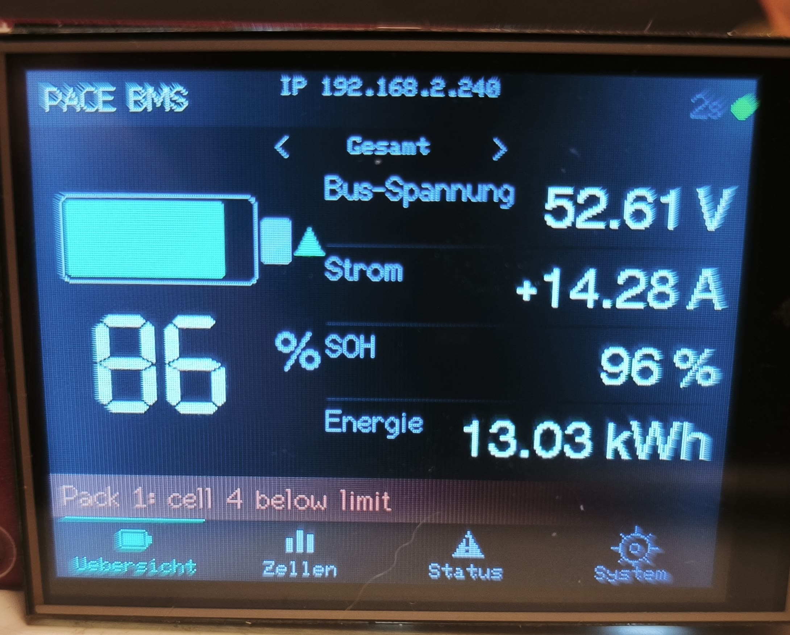
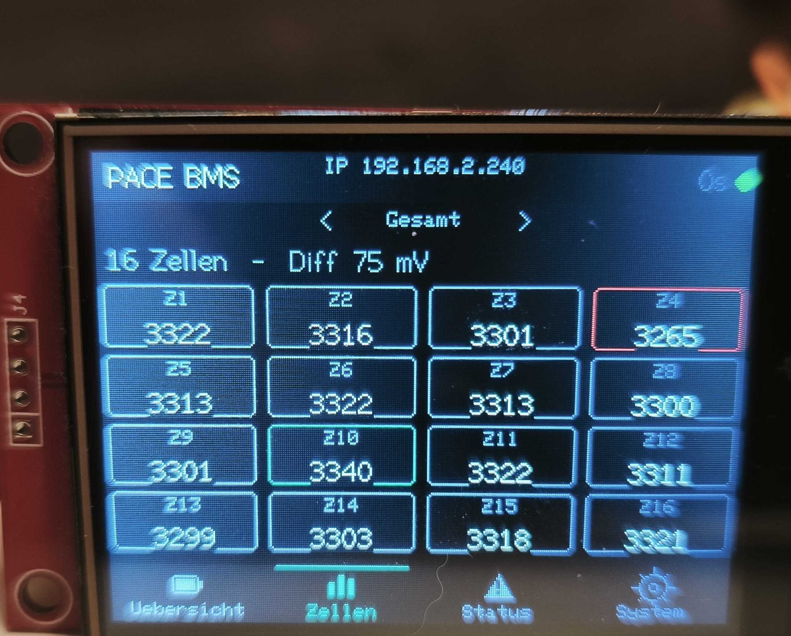
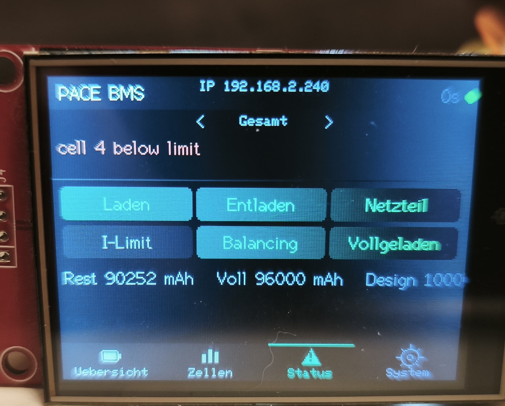
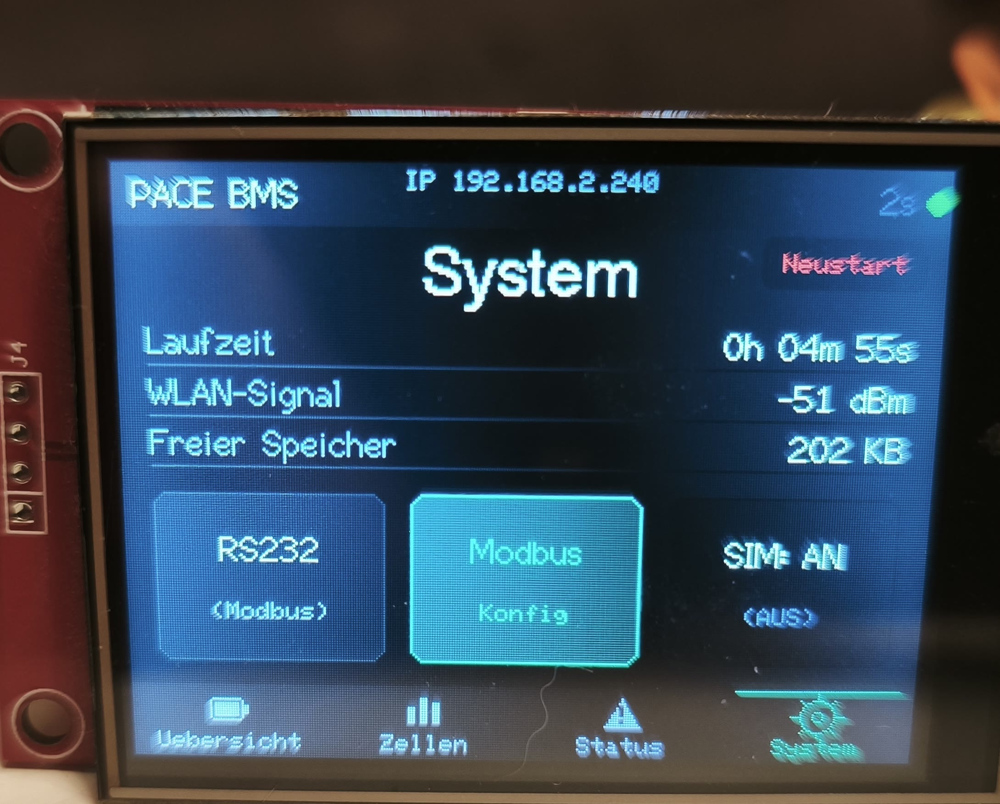

# ESP32 PaceBMS

> Nachbau, Verdrahtung und Nutzung auf eigene Gefahr - keine Garantie für
> Vollständigkeit, Richtigkeit oder Eignung für einen bestimmten Zweck. Beide
> Anschlussarten (RS232 und Modbus RTU/RS485) wurden ausführlich gegen ein
> echtes PACE-BMS (Mehrpack-Stack) verifiziert (siehe „Stand / Umfang" unten).

ESP32-Firmware zum Auslesen eines PACE-basierten BMS mit Web-Oberfläche und
MQTT/Home-Assistant-Anbindung. Zwei wählbare Anschlussarten (Umschalter im
Konfiguration-Tab):

- **RS232** (Standard) — das ASCII-Hex-Protokoll, portiert von
  [Tertiush/bmspace](https://github.com/Tertiush/bmspace) (Python).
- **Modbus RTU / RS485** — nach dem offiziellen Modbus-Registerdokument von
  [syssi/esphome-pace-bms](https://github.com/syssi/esphome-pace-bms) (siehe
  „Modbus RTU / RS485" unten für Einschränkungen).

## Stand / Umfang

- **Nur Lesen, bewusst.** Implementiert sind ausschließlich Auslese-Kommandos
  (Version, Seriennummer, Zellspannungen/Temperaturen/Strom/Spannung, Kapazität,
  Warn-/Schutz-/Balancing-Status). Das offizielle PACE-RS232-Protokoll definiert
  zwar auch Schreib-/Steuerbefehle (u.a. Lade-/Entlade-MOSFET schalten, Buzzer,
  Strombegrenzung-Gangwahl) — diese werden hier aus Sicherheitsgründen bewusst
  **nicht** implementiert, da ein versehentlich geschaltetes MOSFET an einem
  Akkupack ein echtes Risiko ist, kein reines Komfort-Feature.
- Unterstützt mehrere parallelgeschaltete Packs — bei RS232 meldet das BMS die
  Anzahl selbst (wie das Python-Original), bei Modbus werden die installierten
  Pack-Adressen manuell im Konfiguration-Tab angehakt. Display, Web-UI und MQTT
  decken in beiden Fällen alle konfigurierten Packs ab (siehe „Pack-Erkennung &
  Verhalten bei Trennung" unten).
- MQTT mit **Home-Assistant-Autoerkennung** (MQTT Discovery) — Sensoren erscheinen
  automatisch in Home Assistant, keine manuelle YAML-Konfiguration nötig (siehe
  „MQTT / Home Assistant" unten).
- **Zwei BMS-Anschlussarten** (RS232 oder Modbus RTU/RS485), umschaltbar über den
  Konfiguration-Tab, ohne Neu-Flashen — siehe „Modbus RTU / RS485" unten.
  Beide Pfade wurden in diesem Release-Stand gegen echte Hardware verifiziert
  (Mehrpack-Stack, PACE P16S100A).

## Kompatible Geräte (ungetestet)

Folgende Geräte laufen laut [syssi/esphome-pace-bms](https://github.com/syssi/esphome-pace-bms)
mit einem PACE-BMS-Innenleben über dessen RS485/Modbus-Protokoll — mit dem hier
neu eingebauten Modbus-Modus (siehe unten) also potenziell direkt nutzbar, auch
wenn das an keinem dieser Geräte selbst getestet wurde:

- Katbatt 6.4kWh LiFePO4 (PACE BMS P16S200A)
- Gobel Power GP-SR1-LF280-RN150 51.2V 280Ah (PACE BMS S16A150)
- Joyvoit Suns Energy Battery JVBW5KW (PACE BMS P16S100A)
- Orient Power Wall Mounted Battery 48V100AH
- SOK 100Ah 48V Server Rack Berry (PACE BMS P16S100A)
- MeritSun / i-finity LFP 200 - 48V
- Revov R100 51.2V 100Ah
- NPP 51.2V 280AH FLCD-30048
- PowMr 51.2V 100Ah (PACE BMS P16S150A)
- BSL Batt (mehrere Modelle, Firmware 1.51)
- Docan Energy Panda Battery Bank

Zusätzlich vom Python-Referenzprojekt (RS232, dieselbe Protokollfamilie wie hier)
bestätigt: Greenrich U-P5000, Hubble Lithium (AM2, AM4, X-101), Revov R9, SOK 48V
(100Ah), YouthPower Rack Module, Allith 10kW, Joyvoit BW5KW.

## Hardware

- ESP32 NodeMCU-Board (PlatformIO-Boardname `esp32dev`)
- MAX3232-Modul (oder ähnlicher RS232-Transceiver) zwischen ESP32-UART2 und dem
  RS232-Port des BMS. Die PACE-BMS-Ports sind **echtes RS232**, nicht TTL — ohne
  Pegelwandler wird nichts empfangen und im schlimmsten Fall Hardware beschädigt.
- 2.4" TFT SPI, 320×240, ILI9341-Treiber + resistiver Touch (XPT2046). Andere Displaygrößen mit demselben
  Treiber sollten auch funktionieren.

### BMS-UART (UART2)

| ESP32 (UART2) | MAX3232       |
|---------------|---------------|
| GPIO32 (TX2)  | T1IN          |
| GPIO34 (RX2)  | R1OUT         |
| GND           | GND           |
| 3V3           | VCC           |

Bewusst **nicht** GPIO16/17 (Standard-UART2-Pins) — die sind durch das Display
belegt (siehe unten). GPIO34 ist input-only, für reinen RX-Betrieb unproblematisch.

| MAX3232 (RS232-Seite)  | BMS RJ11 (Blick in die Buchse, Nase unten)   |
|------------------------|----------------------------------------------|
| T1OUT                  | Pin 4 (BMS_Rx)                               |
| R1IN                   | Pin 3 (BMS_Tx)                               |
| GND                    | Pin 2 / Pin 5 (GND)                          |

UART-Parameter: **9600 Baud, 8N1** (siehe `include/Config.h`).

Pin 2 und Pin 5 sind laut [syssi/esphome-pace-bms](https://github.com/syssi/esphome-pace-bms)
beide GND (symmetrische Belegung der 6P6C-Buchse) — Pin 5 wurde zusätzlich an
echter Hardware bestätigt (PACE P16S100A). Die genaue RJ11-Belegung kann je
nach Marke/Modell trotzdem abweichen — vor dem Anschließen mit einem
Multimeter/Oszilloskop verifizieren.

**Das Pack am RS232-Port muss per Dip-Schalter auf Adresse 1 stehen.** Laut
offiziellem PACE-RS232-Protokolldokument gilt Adresse 1 als Master-Rolle im
Master-Slave-Verbund: nur ein Pack mit Adresse 1 aggregiert und meldet die
Daten aller Packs im Stack; jedes anders adressierte Pack antwortet nur für
sich allein. Diese Firmware sendet immer ADR=1 (fest, nicht konfigurierbar,
wie auch im Python-Referenzprojekt) — steht das physische Master-Pack auf
einer anderen Adresse, bleibt die RS232-Antwort aus oder unvollständig.

### Modbus RTU / RS485 (alternativer Anschluss, UART1)

Anderer physischer Port am BMS als RS232 (siehe „Modbus RTU / RS485" weiter
unten für Protokoll-Details/Einschränkungen). Nutzt ein MAX485-Modul mit
gemeinsamer DE/RE-Steuerleitung (ein GPIO für Sende-/Empfangsumschaltung, üblich
bei günstigen Modulen):

| ESP32 (UART1) | MAX485-Modul |
|---------------|--------------|
| GPIO26 (TX)   | DI           |
| GPIO25 (RX)   | RO           |
| GPIO5         | DE + RE (verbunden) |
| 3.3V          | VCC          |
| GND           | GND          |

Modul-Pins `A`/`B` zum RS485-Port des BMS (RJ45):

| RJ45-Pin (Blick in die Buchsenöffnung, Rastnase unten - Pin 1 links) | Funktion | T-568B-Farbe |
|---|---|---|
| 1 | B- | Orange-Weiß |
| 2 | A+ | Orange |
| 3 | GND | Grün-Weiß |

Quelle: [syssi/esphome-pace-bms](https://github.com/syssi/esphome-pace-bms).
Modul mit **3.3V versorgen, nicht 5V** — sonst passt der TTL-Pegel zwischen
Modul und ESP32 nicht. UART-Parameter: **9600 Baud, 8N1**. Bei mehreren Packs
am selben Bus: falls Modul/Packs per Jumper Abschlusswiderstände (120Ω)
anbieten, an beiden physischen Bus-Enden aktivieren — siehe „Modbus RTU /
RS485" weiter unten für die tatsächlich nötige Mehrpack-Verkabelung.

### Display + Touch (TFT_eSPI + XPT2046)

Getrennte SPI-Busse wie im Haustürklingel-Projekt: Display auf HSPI (TFT_eSPI-eigene
Instanz), Touch auf VSPI (globales Arduino-`SPI`-Objekt, `XPT2046_Touchscreen`
erlaubt keine eigene Instanz). Konfiguration läuft komplett über `build_flags` in
`platformio.ini` (keine `User_Setup.h`-Änderungen nötig).

| Signal | Pin | Bus |
|---|---|---|
| TFT_SCLK | 14 | HSPI (nativ) |
| TFT_MOSI | 4 | GPIO-Matrix |
| TFT_CS | 17 | GPIO |
| TFT_DC | 21 | GPIO |
| TFT_RST | 16 | GPIO |
| Backlight (PWM) | 22 | GPIO (ledc) |
| TOUCH_SCLK | 18 | VSPI (nativ) |
| TOUCH_MOSI | 23 | VSPI (nativ) |
| TOUCH_MISO | 19 | VSPI (nativ) |
| TOUCH_CS | 27 | GPIO |
| TOUCH_IRQ | 33 | GPIO |

Einbau **horizontal (Querformat)**, `TFT_ROTATION=1` in `include/Config.h`.
Touch-Kalibrierung: werksseitig nur ein grober Fallback-Bereich hinterlegt — die
4-Ecken-Kalibrierung durchführen, indem **10 Sekunden lang** irgendwo auf dem
Display gedrückt gehalten wird (funktioniert unabhängig von WLAN). Die Werte
werden dauerhaft im NVS (`pacebms_calib`) gespeichert.

### Werksreset

Den **BOOT/FLASH-Button** auf dem ESP32-Board (GPIO0) **8 Sekunden lang**
gedrückt halten löscht gespeicherte WLAN-/MQTT-Zugangsdaten (`pacebms_cred`)
und die Touch-Kalibrierung (`pacebms_calib`) aus dem NVS und startet neu —
danach öffnet sich wieder das Einrichtungsportal. Bewusst über den physischen
Button statt eine Touch-Geste, da er auch funktionieren muss, wenn WLAN oder
die Touch-Kalibrierung selbst kaputt sind, und damit er nicht mit der
10s-Kalibrier-Geste am Display kollidiert.

## Display-Oberfläche

Kopfzeile: Titel, WLAN-Status (IP-Adresse, oder `Setup 10.0.0.1` solange das
Einrichtungsportal offen ist, oder `Verbinde...`), rechts ein Aktivitätspunkt
für den BMS-Abfragezyklus statt einer reinen Sekundenzahl: **grau** (Ruhe
zwischen zwei Abfragen), **rot** (Anfrage raus, wartet auf Antwort), **grün**
(Antwort angekommen, kurzes Aufblitzen), oder ein **gelbes Warndreieck** (seit
deutlich länger als einem Zyklus keine Antwort mehr — WLAN weg, Pack
getrennt, o.ä.). Darunter vier Tabs am unteren Bildschirmrand (per Touch
umschaltbar):

- **Übersicht** — Batteriesymbol + SOC groß, Lade-/Entladepfeil, Spannung, Strom,
  SOH, bei Einzel-Pack-Ansicht zusätzlich Zyklen, und immer eine Energie-Zeile
  in kWh (Spannung × Restkapazität); Warnbanner unten, falls Warnungen anliegen.
- **Zellen** — Rasteransicht aller Zellspannungen, Min/Max farblich hervorgehoben,
  Zell-Diff im Header.
- **Status** — Warnungen im Klartext, Schutz-/FET-/Balancing-Zustände als Badges,
  Kapazitätswerte (Rest/Voll/Design).
- **System** — Laufzeit, WLAN-Signal, freier Speicher (Chip-/CPU-/Flash-Details
  stehen nur im Web-UI-System-Tab); darunter drei große Buttons nebeneinander:
  **RS232/Modbus** (aktueller Zustand groß, die Alternative klein in Klammern
  darunter), **Modbus-Konfig** (öffnet den Vollbild-Screen zur
  Pack-Adressauswahl, siehe „Modbus RTU / RS485" oben) und **Sim: AN/AUS**
  (gleiches Klammer-Prinzip). Ein **Neustart**-Button sitzt oben rechts,
  räumlich getrennt von diesen drei Buttons.

| Übersicht | Zellen |
|---|---|
|  |  |

| Status | System |
|---|---|
|  |  |

*Die `‹ Gesamt ›`-Leiste im Übersicht-Screenshot oben ist kein reiner Text -
horizontales Wischen dort wechselt zwischen der Gesamt-Ansicht und den
einzelnen Packs, siehe unten.*

Auf Übersicht/Zellen/Status zeigt eine kleine Leiste unter der Kopfzeile
("Gesamt" oder "Pack X von N" mit `‹ ›`-Wischhinweis), welches Pack gerade
angezeigt wird. Per **horizontalem Wischen** irgendwo im Inhaltsbereich wechselt
man zwischen der aggregierten **Gesamt**-Ansicht (Strom/Kapazität/Energie über
alle Packs summiert, Spannung gemittelt — Zyklen entfällt dort, da sich
Zyklenzahlen nicht sinnvoll summieren lassen) und den einzelnen Packs; die
Auswahl gilt seitenübergreifend für alle drei Tabs.

Nur der Aktivitätspunkt aktualisiert sich alle 150ms eigenständig (kleinste
mögliche Fläche, Rest der Kopfzeile bleibt unberührt); der übrige Seiteninhalt
zeichnet komplett nur neu, wenn sich wirklich etwas ändert (neue BMS-Daten,
Tab-Wechsel, Pack-Wechsel, Kalibrierung). Ein solcher voller Redraw wird dabei
zunächst unsichtbar in einem Sprite-Puffer (`TFT_eSprite`, Bildschirmgröße
320×240) zusammengesetzt und erst fertig in einem Zug aufs Display übertragen,
statt den Bildschirm direkt zu löschen und Element für Element neu zu
zeichnen — Letzteres verursachte ein kurzes, aber deutlich sichtbares
Aufblitzen bei jeder Aktualisierung. Der Puffer läuft in 8-Bit-Farbtiefe
(RGB332, ~77KB Heap) statt 16-Bit (~150KB), da der größte zusammenhängende
freie Speicherblock auf diesem Board (kein PSRAM) für 16-Bit nicht ausreicht;
schlägt die Allokation dennoch fehl, fällt die Firmware automatisch auf
direktes Zeichnen zurück (`DISPLAY_USE_SPRITE_BUFFER` in `Config.h` schaltet
das Verfahren auch manuell ab). Die sechs Akzentfarben in `BmsDisplayUi.cpp`
sind bewusst auf Werte abgestimmt, die diese 8-Bit-Rundung ohne sichtbaren
Farbstich überstehen. Die Warnbanner-Fläche auf der Übersicht ist außerdem
immer reserviert, unabhängig davon, ob gerade eine Warnung ansteht — sonst
würden die Statuszeilen bei jedem Erscheinen/Verschwinden einer Warnung
sichtbar springen.

Das Abfrageintervall (Standard 5s) lässt sich im **Konfiguration**-Tab der
Weboberfläche ändern (Sekunden-Eingabefeld) — wirkt sofort, ohne Neustart,
anders als die übrigen Einstellungen dort.

## Modbus RTU / RS485

Alternative zum RS232-Anschluss, umschaltbar im **Konfiguration**-Tab (Web) oder
über den "RS232/Modbus"-Button im **System**-Tab des Displays — Auswahl
speichern startet neu, wie bei WLAN/MQTT-Änderungen. Implementiert nach dem
Registerdokument
[PACE-BMS-Modbus-Protocol-for-RS485-V1.3-20170627.pdf](https://github.com/syssi/esphome-pace-bms/blob/main/docs/PACE-BMS-Modbus-Protocol-for-RS485-V1.3-20170627.pdf)
(`syssi/esphome-pace-bms`). Ein einzelner Read-Holding-Registers-Request
(Register 0-36) liefert Strom/Spannung/SOC/SOH/Kapazitäten/Zyklen, Warn-/
Schutz-/Status-Flags, alle 16 Zellspannungen sowie 6 Temperatursensoren (4×
Zelle, MOSFET, Umgebung) in einem Rutsch — Version/Seriennummer werden über
Modbus nicht gelesen.

**Mehrpack-Betrieb:** Anders als RS232 (ein Befehl liefert alle Packs auf
einmal) ist bei Modbus jedes physische Pack ein eigener Bus-Teilnehmer mit
eigener Adresse (vier Dip-Schalter am Pack, Bereich **0-15** laut offiziellem
PACE-RS232-Protokolldokument - derselbe Adressbereich gilt auch für Modbus).
Welche Adressen tatsächlich verbaut sind, wird entweder im Konfiguration-Tab
unter **„Modbus-Konfiguration"** (Web) oder direkt am Gerät über den
"Modbus-Konfig"-Button im **System**-Tab angehakt (Checkboxen/Kacheln 0-15,
gespeichert als Bitmaske, wirksam nach Neustart). Jeder Zyklus fragt genau die
angehakten Adressen der Reihe nach ab; eine
einzelne nicht antwortende Adresse wird — wie bei RS232 — erst nach
`BMS_ZERO_AFTER_CONSECUTIVE_FAILURES` aufeinanderfolgenden Fehlversuchen
einzeln auf 0 gesetzt, ohne die übrigen Packs zu beeinflussen. Adressen können
Lücken haben (z.B. 1 und 3, ohne 2) — Display, Web-UI und MQTT zeigen dabei
konsequent die echte Adresse als Packnummer an, nicht eine reine Zählnummer.

**Einschränkungen gegenüber RS232:**
- Keine Entsprechung für "Vollgeladen", "Pack Indicate" und "Netzteil/AC-In" im
  Status-Tab — diese Felder gibt es im Modbus-Registersatz schlicht nicht,
  bleiben also leer/aus.
- Version/Seriennummer werden nicht ausgelesen (Anzeige zeigt "Modbus" statt
  einer echten Versionsnummer).
- **Adresse 0 ist mit Vorsicht zu genießen**: Die Dip-Schalter-Tabelle im
  offiziellen Dokument listet sie regulär, aber die Modbus-Funktionscode-
  Tabelle im selben Dokument nennt als gültigen Slave-Adressbereich für
  tatsächliche Leseanfragen `0x01-0x10` (1-16) — ohne die 0.

**An echter Hardware getestet und bestätigt funktionsfähig** (mehrere Packs
gleichzeitig, reale Zell-/Spannungs-/Strom-/Kapazitätswerte). Zwei
praxisrelevante Punkte, die beim Einrichten leicht übersehen werden:

- **Physischer Port**: das BMS hat oft *zwei* äußerlich als "CAN/RS485"
  zusammengefasste, aber elektrisch komplett getrennte Buchsen nebeneinander
  (z.B. rechte Buchse = echtes CAN, linke = RS485) — nicht eine einzelne
  Buchse mit gemeinsamen Pins für beides. Nur die RS485-Seite liefert Modbus;
  am (davon unabhängigen) separaten reinen "RS485"-Anschluss (falls das BMS
  einen hat) läuft stattdessen ein proprietärer, ASCII-basierter interner
  Pack-zu-Pack-Bus, kein Modbus. Diese reinen RS485-Buchsen dienen
  ausschließlich der Kommunikation der Packs untereinander (Master fragt
  Slaves intern ab) — genau diese intern gesammelten Daten liefert der
  Master dann über seinen RS232-Port als Stack-Aggregat nach außen. Eine
  vergleichbare Aggregation gibt es bei Modbus nicht: jedes Pack antwortet
  nur für sich selbst, ein "Gesamt"-Wert über alle Packs kommt nicht vom
  BMS, sondern wird von dieser Firmware selbst aus den Einzelwerten
  berechnet (siehe Display-Oberfläche → Gesamt-Ansicht oben).
  **Vorsicht, Beschriftung kann in die Irre führen**: manche BMS beschriften
  diese rein interne Daisy-Chain-Buchse (2x, technisch eher ein "Battery
  Link") schlicht mit **"RS485"**, obwohl der tatsächliche externe
  RS485-Zugang für Modbus stattdessen als Hälfte des kombinierten
  "CAN/RS485"-Ports (siehe oben) ausgeführt ist. Die Beschriftung allein
  verrät also nicht zuverlässig, welche Buchse welche ist — im Zweifel
  nachmessen/ausprobieren.
- **Mehrpack-Verkabelung**: die Ketten-Durchschleifung zwischen den Packs
  (z.B. über die zweite RS485-Buchse jedes Packs) reicht nicht aus, um andere
  Packs per Modbus zu erreichen — beim Testen antwortete über diese Kette
  zuverlässig nur das Pack, an dem das USB/RS485-Interface direkt hing, andere
  Adressen liefen in den Timeout, unabhängig vom Timing (auch mit
  großzügigem Throttle). Andere Nutzer mit demselben Problem bei identischem
  Setup bestätigen das
  ([DIY Solar Forum-Thread](https://diysolarforum.com/threads/pace-bms-rs-485-which-can-be-used-to-poll-daisy-chained-batteries.113619/)).
  Erst als alle Packs mit ihrer RS485-Seite **parallel an denselben Bus**
  verdrahtet wurden (am saubersten über ein Patchpanel, A an A, B an B, GND an
  GND, statt einzeln durchzuschleifen), antworteten alle Adressen zuverlässig.

## Pack-Erkennung & Verhalten bei Trennung

Beide Protokolle füllen dieselben `PaceBmsSnapshot`-Structs, unterscheiden
sich aber darin, woher die Pack-Anzahl/-Nummerierung kommt:

- **RS232**: Die Anzahl der Packs wird **nicht konfiguriert**, sondern kommt
  live vom BMS. Die Antwort auf das Analogdaten-Kommando (CID2 `0x42`, Anfrage
  mit Pack-Byte `FF` = alle Packs) beginnt mit einem 2-Zeichen-Hex-Feld, das
  die Pack-Anzahl angibt (`PaceBmsClient::readAnalogData()`); danach folgen
  die Werte für jedes gemeldete Pack der Reihe nach. Die Packnummer ist hier
  einfach die fortlaufende Position (1, 2, 3, ...) — **an echter Hardware
  bestätigt**: ein per Dip-Schalter auf Adresse 0 gestelltes Pack wird vom
  RS232-Master weiterhin mitgezählt (Anzahl blieb bei 3 Packs), die Position
  in der Sammelantwort richtet sich aber nach der internen Auslesereihenfolge,
  nicht nach der tatsächlichen Dip-Schalter-Adresse des einzelnen Packs.
- **Modbus**: Die Pack-Anzahl kommt aus der manuell angehakten Adressliste
  (siehe „Modbus RTU / RS485" oben) — die Packnummer, die Display/Web-UI/MQTT
  anzeigen, ist hier die echte, konfigurierte Bus-Adresse.

Damit ein Pack, das vorübergehend nicht mehr antwortet, nicht einfach mit
veralteten (falschen) Werten stehen bleibt oder wortlos verschwindet:

- **RS232 meldet selbst eine kleinere Pack-Anzahl** (Pack wurde z.B.
  abgeklemmt, BMS antwortet aber weiter): Das fehlende Pack wird sofort auf 0
  zurückgesetzt, bleibt aber als Slot sichtbar/in MQTT veröffentlicht — die
  Pack-Anzahl selbst schrumpft nie von selbst wieder.
- **Eine Adresse antwortet gar nicht mehr** (Timeout, RS232 wie Modbus): Erst
  nach `BMS_ZERO_AFTER_CONSECUTIVE_FAILURES` (3, in `Config.h`)
  aufeinanderfolgenden fehlgeschlagenen Poll-Zyklen wird der betroffene
  Pack-Slot auf 0 gesetzt — entprellt, damit ein einzelner
  verpasster/fehlerhafter Frame nicht sofort alles auf 0 blitzen lässt. Bei
  Modbus geschieht das pro Adresse einzeln, unabhängig von den übrigen Packs.

Die einzelnen Zellspannungs-/Temperatur-MQTT-Topics (`pack_N/v_cells/cell_i`,
`pack_N/temps/temp_i`) werden dabei ebenfalls auf 0 nachpubliziert (`MqttManager`
merkt sich je Pack die höchste je gemeldete Zell-/Sensorzahl und veröffentlicht
bis dahin immer, auch wenn die aktuelle Anzahl kleiner ist) — keine der
retained-Werte bleibt auf einem alten Stand stehen. `N` ist dabei bei beiden
Protokollen dieselbe Packnummer, die auch Display und Web-UI zeigen (RS232:
fortlaufend, Modbus: die echte Bus-Adresse).

## Simulationsmodus (Entwicklung/Vorschau ohne BMS)

Liefert anstelle einer echten BMS-Abfrage ein erfundenes, aber plausibles und
langsam driftendes 3-Pack-Testszenario (16 Zellen/Pack wie bei echten
16S-LiFePO4-Packs, realistische Zellspannungs-Kennlinie mit flachem
Mittelplateau, SOC/Strom pendelnd über ~4 Minuten) - lässt sich Display/Web-UI
ohne angeschlossenes BMS entwickeln und testen.

Umschaltbar zur Laufzeit über den **System**-Tab (Display: "Sim: AN/AUS"-Button;
Web-UI: Button auf der System-Seite) - speichert die Einstellung im NVS und
startet neu. `SIMULATE_BMS_DATA` in `include/Config.h` ist nur der Startwert
für die allererste Inbetriebnahme.

**Wichtig:** Vor dem Anschluss eines echten BMS auf "AUS" umschalten - sonst
werden dauerhaft Fake-Daten statt echter Messwerte angezeigt.

## Architektur: zwei Cores, damit das Display nie einfriert

Die Firmware läuft auf beiden ESP32-Kernen (FreeRTOS), bewusst getrennt:

- **Core 1** (`src/main.cpp`, Arduino-Standard-`loop()`): ausschließlich Display +
  Touch (`BmsDisplayUi::update()`). Blockiert nie länger als eine SPI-Transaktion.
- **Core 0** (`src/NetworkTask.*`): WLAN/Captive-Portal, MQTT, Webserver und
  BMS-Polling. Genau das sind die Stellen, die je nach Zustand spürbar blockieren
  können — `PaceBmsClient::readFrame()` wartet bis zu `BMS_RESPONSE_TIMEOUT_MS`
  (500ms) auf eine Antwort, und das bis zu 5× pro Poll-Zyklus; ist gerade kein BMS
  angeschlossen/antwortend, addiert sich das auf über eine Sekunde Blockierung pro
  Zyklus. Läuft das auf demselben Core wie das Display, wirkt die Bedienung träge
  bis eingefroren.

Beide Seiten tauschen sich ausschließlich über `SnapshotStore` aus: ein Mutex-
geschütztes Exemplar von `PaceBmsSnapshot`, das Core 0 nach jedem erfolgreichen
Poll per `set()` veröffentlicht und Core 1 (und die Webserver-Handler, die in
ESPAsyncWebServers eigenem AsyncTCP-Task laufen, also einem dritten Kontext) per
`get()` als Kopie abholen. Der Mutex schützt das gleichzeitige Lesen/Schreiben
der darin enthaltenen `String`-Felder aus mehreren Tasks.

## WLAN & MQTT einrichten (keine Zugangsdaten im Code)

Es gibt keine kompilierten WLAN-/MQTT-Zugangsdaten mehr. Beim ersten Boot (oder
wann immer kein funktionierendes WLAN gespeichert ist) öffnet das Gerät ein
Einrichtungsportal:

1. Mit dem Hotspot **`PaceBMS-Setup`** verbinden (offen, kein Passwort). Die
   meisten Geräte öffnen die Portal-Seite automatisch (Captive-Portal-Erkennung);
   sonst manuell `http://10.0.0.1` aufrufen.
2. WLAN-SSID/Passwort, MQTT-Broker/Port/User/Passwort **und den Gerätenamen**
   eintragen (alles auf derselben Seite, da nichts davon im Voraus bekannt ist).
3. Nach dem Speichern verbindet sich das Gerät und startet MQTT/Webserver.

**Gerätename** ist eine einzelne Einstellung mit drei Auswirkungen zugleich:
mDNS-Name (`<Name>.local`), OTA-Update-Login und MQTT-Topic-Präfix. Bei
**mehreren Geräten** im selben Netz/Broker (z.B. mehrere Akku-Bänke) muss
jedes Gerät hier einen eigenen Namen bekommen (z.B. `pacebms1`/`pacebms2`),
sonst kollidieren mDNS-Name und MQTT-Topics. Der Name erscheint zusätzlich in
der Kopfzeile von Display und Weboberfläche zur einfachen Zuordnung.

Alle drei — WLAN, MQTT und Gerätename — lassen sich später **unabhängig
voneinander** ändern, ohne das Portal erneut zu öffnen: über den
**Konfiguration**-Tab der Weboberfläche (`http://<ip>/konfiguration`), jeweils
eigene Formulare mit eigenem Speichern-Button. Passwortfelder leer lassen =
unverändert übernehmen. Jedes Speichern startet das Gerät neu, um die neuen
Werte zu übernehmen.

Das Portal bricht nie mehr in den Bedienfluss ein: Verbindungsaufbau und Portal
laufen nicht-blockierend auf dem Netzwerk-Task (siehe Architektur oben), das
Display bleibt währenddessen normal bedienbar.

## Bauen & Flashen

1. PlatformIO installieren (CLI oder VS-Code-Extension).
2. Bei Bedarf `include/Config.h` anpassen (Pins, Standard-Poll-Intervall,
   MQTT-Basistopic, HA-Discovery an/aus, AP-Name/IP der Einrichtung).
3. Bauen und flashen:
   ```
   pio run
   pio run -t upload
   ```
4. WLAN/MQTT wie oben beschrieben über das Einrichtungsportal konfigurieren.

Das Gerät ist per mDNS auch unter `http://<OTA_HOSTNAME>.local` erreichbar
(Standard: `http://pacebms.local`), ohne die IP-Adresse nachschlagen zu müssen.

Für spätere Updates steht danach auch OTA über
[ElegantOTA](https://github.com/ayushsharma82/ElegantOTA) bereit:
`http://<ip-oder-hostname>/update` (HTTP-Basic-Auth, siehe `OTA_HOSTNAME`/
`OTA_PASSWORD` in `include/Config.h` — vor einem echten Einsatz das
Standardpasswort ändern). Ein Neustart-Button (Display: System-Tab, oben
rechts; Web-UI: System-Tab) startet das Gerät auch ohne Update jederzeit neu.

## Web-Oberfläche

Nach dem Verbinden läuft ein Webserver auf Port 80 mit Tabs analog zum Display
(Übersicht/Zellen/Status, aktualisiert alle 5 Sekunden per `GET /api/data`,
JSON; System per `GET /api/system`) plus dem oben beschriebenen
**Konfiguration**-Tab. Der **System**-Tab hat zusätzlich einen
**Kommunikation**-Block: Poll-Intervall, Dauer des letzten Auslesezyklus,
Fehlversuche in Folge, UART-Parameter, MQTT-Verbindungsstatus, bei Modbus
zusätzlich Fehlversuche pro Pack-Adresse, sowie Start/Ergebnis-Buttons für
einen passiven Bus-Mitschnitt (`/api/modbus-sniff`) — nützlich zum Debuggen
der RS485-Verkabelung ohne USB/Serial-Zugriff.

## MQTT / Home Assistant

Alle Werte werden unter dem Topic-Präfix `<Gerätename>/...` veröffentlicht
(siehe „Geräte­name" oben — ein Wert, konfigurierbar über den
Konfiguration-Tab oder das Ersteinrichtungsportal, dient gleichzeitig als
mDNS-Name, OTA-Login und MQTT-Präfix), inklusive Home-Assistant-MQTT-Discovery
(`homeassistant/...`, ein retained Topic pro Sensor/Binary-Sensor — Home
Assistant legt alle Entitäten automatisch an, keine manuelle YAML-Konfiguration
nötig) für Zellspannungen, Temperaturen, SOC/SOH, Zyklen, Warnungen sowie
Schutz-/FET-/Balancing-Status als Binary Sensors. Zusätzlich pro Pack
`p_pack` (W, berechnet aus Strom × Spannung) sowie stack-weit `stack_power`
(W, Summe aller Packs), `stack_voltage` (V, gemittelt über alle Packs —
bleibt korrekt, auch wenn einzelne Packs gerade offline/genullt sind),
`stack_remaining_capacity` und `stack_full_capacity` (jeweils mAh, Summe aller
Packs mit aktuell gemeldeter Spannung > 0). Broker/Port/User/Passwort werden
wie oben beschrieben eingerichtet, nicht im Code.

## Projektstruktur

- `include/PaceBmsProtocol.h`, `src/PaceBmsProtocol.cpp` — Frame-Aufbau,
  Checksum/LCHKSUM, Antwort-Parsing (protokoll-, nicht hardwarespezifisch).
- `include/PaceBmsClient.h`, `src/PaceBmsClient.cpp` — Kommandos (Version,
  Seriennummer, Analogdaten, Kapazität, Warn-Info) über eine `HardwareSerial`.
- `include/ModbusRtuProtocol.h`, `src/ModbusRtuProtocol.cpp` — Modbus-RTU-
  Framing (CRC16, Read-Holding-Registers), analog zu `PaceBmsProtocol`.
- `include/PaceModbusClient.h`, `src/PaceModbusClient.cpp` — liest das
  PACE-Modbus-Registerschema (siehe „Modbus RTU / RS485" oben) in dieselben
  `BmsData.h`-Strukturen wie `PaceBmsClient`.
- `include/BmsData.h` — Datenstrukturen für den zuletzt gelesenen Zustand,
  protokollunabhängig (RS232 und Modbus füllen dieselben Structs).
- `include/SnapshotStore.h`, `src/SnapshotStore.cpp` — Mutex-geschützter
  Austausch des Snapshots zwischen Core 0 und Core 1 (siehe Architektur oben).
- `include/NetworkTask.h`, `src/NetworkTask.cpp` — FreeRTOS-Task (Core 0):
  WLAN/MQTT/Webserver/BMS-Polling.
- `include/CredentialsStorage.h`, `src/CredentialsStorage.cpp` — WLAN-/MQTT-
  Zugangsdaten, NVS-persistiert, getrennt speicherbar.
- `src/WifiProvisioning.*` — nicht-blockierendes WLAN-Connect + Captive-Portal
  (WiFiManager-Lib).
- `src/MqttManager.*`, `src/WebUiServer.*` — MQTT/HA-Discovery, Web-UI inkl.
  Konfiguration-Tab.
- `src/DisplayHardware.*` — TFT_eSPI/XPT2046-Init, Backlight-PWM.
- `src/StorageCalibration.*` — Touch-Kalibrierung, NVS-persistiert.
- `src/TouchCalibration.*` — 4-Ecken-Kalibrierroutine (10s-Dauerdruck-Trigger) +
  kalibrierte Touch-Abfrage.
- `src/BmsDisplayUi.*` — Dashboard-Zeichnen + Tab-/Pack-Navigation
  (Tap + horizontales Wischen), Touch-Handling.
- `include/SimulatedBms.h`, `src/SimulatedBms.cpp` — Fake-Datengenerator für den
  Simulationsmodus (siehe oben).
- `include/RuntimeSettings.h`, `src/RuntimeSettings.cpp` — NVS-persistierte
  Laufzeit-Einstellungen (Simulationsmodus, BMS-Anschlussart RS232/Modbus,
  Modbus-Pack-Adressen, Poll-Intervall).
- `include/BmsActivity.h`, `src/BmsActivity.cpp` — Zeitstempel für den letzten
  Abfrage-/Antwort-Zeitpunkt, Core-übergreifend gelesen vom Aktivitätspunkt in
  der Display-Kopfzeile (siehe „Display-Oberfläche" oben).
- `include/FactoryReset.h`, `src/FactoryReset.cpp` — Werksreset über den
  BOOT/FLASH-Button (siehe oben).
- `src/main.cpp` — Core-1-Einstiegspunkt: nur Display-Setup + Display-Loop.
- `docs/images/` — Display-Screenshots (siehe „Display-Oberfläche" oben).

## Lizenz

[PolyForm Noncommercial License 1.0.0](LICENSE) - nichtkommerzielle Nutzung frei
erlaubt, kommerzielle Nutzung ausgeschlossen. Keine Gewährleistung, siehe oben
und Lizenztext.
